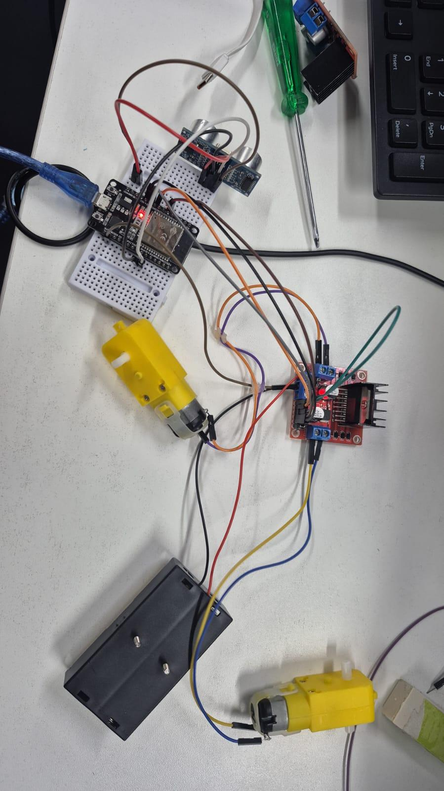

# Carrinho-robô com ESP32

Documentação inicial da **Tarefa 13 — Requisitos do projeto**, desenvolvida para a disciplina **Project-based Maker Lab**.

## Identificação do projeto

| Campo        | Informação          |
|--------------|---------------------|
| Instituição  | FIAP                |
|   Turma      | 4ESPX               |
| Professora   | Gedeane Kenshima    |
|   Grupo      | Start-up One        |
|   Data       | 13/08/2026          |
| Repositório  | [Acessar o projeto no GitHub](https://github.com/GuilhermeSSantos2004/Carrinho-Robo) |

## Integrantes


| Nome completo                           |    RM    |
|-----------------------------------------|----------|
| Enricco Rossi de Souza Carvalho Miranda | RM551717 |
| Gabriel Marquez Trevisan                | RM99227  |
| Guilherme Silva dos Santos              | RM551168 |
| Danilo Urze Aldred                      | RM99465  |
| Laura Claro Mathias                     | RM98747  |


## 1. Objetivo do projeto

Construir um carrinho-robô pequeno, de baixo custo e fácil montagem, controlado por um celular. O ESP32 criará uma rede Wi-Fi local e uma página simples com os comandos **avançar**, **recuar**, **virar à esquerda**, **virar à direita** e **parar**. Assim, o protótipo não dependerá de internet nem de um aplicativo específico.

## 2. Conceito escolhido

O carrinho utilizará tração diferencial **2WD**: dois motores independentes movimentam as rodas laterais e um rodízio livre apoia a parte dianteira. Para virar, o ESP32 altera o sentido ou a velocidade de cada motor por meio da ponte H L298N. O sensor HC-SR04 fará a detecção frontal de obstáculos.

### Por que essa solução?

- O ESP32 já possui Wi-Fi, evitando um módulo de comunicação adicional.
- Dois motores são suficientes para movimentar e direcionar o carrinho.
- O L298N disponível no grupo controla separadamente o sentido e a velocidade dos dois motores.
- O HC-SR04 acrescenta proteção contra colisões frontais.
- O chassi retangular pode ser cortado em MDF ou acrílico de 3 mm.
- A alimentação separada reduz ruídos dos motores e facilita os primeiros testes.

## 3. Ficha de requisitos

### 3.1 Requisitos físicos e mecânicos

| Item | Requisito definido |
|---|---|
| Dimensões do chassi | 200 mm × 150 mm × 3 mm (comprimento × largura × espessura) |
| Dimensão máxima montada | Aproximadamente 200 mm × 190 mm × 90 mm, incluindo rodas e carenagem |
| Material do chassi | MDF de 3 mm; acrílico de 3 mm é uma alternativa |
| Quantidade de motores | 2 motores DC com caixa de redução, modelo TT, 3–6 V |
| Rodas | 2 rodas de 65 mm para os motores e 1 rodízio livre dianteiro |
| Placa controladora | ESP32 DevKit V1, módulo ESP32-WROOM-32 |
| Driver dos motores | Ponte H L298N de dois canais |
| Sensor de distância | HC-SR04 instalado na parte frontal |
| Fixação | Parafusos M3, espaçadores e abraçadeiras; componentes sem contato direto com o MDF |
| Massa-alvo | Até 1,2 kg com as baterias |
| Carenagem | Cobertura removível de aproximadamente 170 mm × 115 mm × 55 mm |
| Material da carenagem | Placa de polipropileno de 1 mm, acetato grosso ou impressão 3D leve |
| Acesso externo | Conector USB do ESP32 e chave da alimentação dos motores devem ficar acessíveis |
| Ventilação | Aberturas laterais próximas ao ESP32 e ao driver |

### 3.2 Requisitos elétricos e de controle

| Item | Requisito definido |
|---|---|
| Opção A de alimentação | 8 pilhas AA Duracell divididas em dois suportes independentes de 4 pilhas (6 V por suporte) |
| Opção B de alimentação | Pack Li-Ion 7,4 V, 2500 mAh, com BMS |
| Alimentação dos motores | Um suporte de 4 pilhas (6 V) ou a saída principal do pack Li-Ion, conforme a opção escolhida |
| Alimentação do ESP32 e sensor | Saída de 5 V regulada por um conversor LM2596 |
| Referência elétrica | Bateria, LM2596, ESP32, L298N e HC-SR04 devem compartilhar GND |
| Comunicação | Rede Wi-Fi local criada pelo ESP32, sem necessidade de internet |
| Interface | Página web acessada pelo celular, com cinco comandos de movimento |
| Controle de velocidade | PWM independente para cada motor |
| Segurança de software | Parada automática se nenhum comando for recebido por 1 segundo |
| Sensor de obstáculos | HC-SR04 com `TRIG` no GPIO 18 e `ECHO` no GPIO 19 por divisor de tensão |
| Segurança elétrica | Não ligar bateria diretamente ao pino `3V3` ou ao `VIN/5V` sem regulação adequada |

> Na opção com 8 pilhas, **não ligar as oito em série**, pois isso produziria aproximadamente 12 V. Usar dois bancos independentes de 4 pilhas: um para os motores e outro para o LM2596. Não misturar pilhas novas e usadas. O BMS do pack Li-Ion protege as células, mas não substitui o carregador 2S apropriado.

## 4. Lista inicial de materiais e precificação

Preços consultados em **27/08/2026**, sem frete. Os valores podem variar até a compra.

| Quantidade | Componente | Observação | Preço estimado | Referência |
|---:|---|---|---:|---|
| 1 | ESP32 DevKit V1 com cabo USB | Controlador principal; dispensa HC-05/HM-10 | R$ 64,99 | [Casa da Robótica](https://www.casadarobotica.com/placas-embarcadas/esp/placas/placa-esp32-com-wi-fi-bluetooth-esp32s-ide-dual-core-dev-kit-v1-cabo-micro-usb) |
| 1 | Ponte H L298N | Controle dos dois motores | R$ 14,90 | [Eletrogate](https://www.eletrogate.com/ponte-h-dupla-l298n) |
| 1 | Kit chassi 2WD | Inclui base, dois motores, rodas e rodízio | R$ 54,99 | [Casa da Robótica](https://www.casadarobotica.com/robotica/chassi-s/carros/kit-chassi-2-rodas) |
| 1 | Sensor HC-SR04 | Detecção frontal de obstáculos | R$ 9,90 | [Eletrogate](https://www.eletrogate.com/modulo-sensor-de-distancia-ultrassonico-hc-sr04) |
| 1 | Conversor LM2596 | Ajustar a saída para 5,0 V antes de ligar o ESP32 | R$ 8,90 | [Eletrogate](https://www.eletrogate.com/modulo-regulador-de-tensao-step-down-lm2596) |
| 3 kits | Jumpers M-M, M-F e F-F | Um kit de cada tipo | R$ 25,70 | [M-M](https://www.eletrogate.com/jumpers-macho-macho-40-unidades-de-10-cm), [M-F](https://www.eletrogate.com/jumpers-macho-femea-40-unidades-de-20-cm) e [F-F](https://www.eletrogate.com/jumpers-femea-femea-40-unidades-de-10-cm) |
| 2 | Suporte para 4 pilhas AA | Necessários somente na opção com 8 pilhas | R$ 9,80 | [Eletrogate](https://www.eletrogate.com/suporte-para-4-pilhas-aa-branco-) |
| 8 | Pilhas AA Duracell | Opção A de alimentação | R$ 62,00 | [Amazon](https://www.amazon.com.br/Duralock-Pilha-Alcalina-Unidades-Duracell/dp/B07FKWTQPH) |
| 1 | Pack Li-Ion 7,4 V 2500 mAh com BMS | Opção B, substitui as 8 pilhas e os suportes | R$ 66,00 | [RoboCore](https://www.robocore.net/baterias-fontes/pack-bateria-li-ion-7_4v-2500mah-com-bms) |
| 1 | Carregador Li-Ion 2S | Necessário se o grupo não possuir carregador compatível | R$ 37,90 | [RoboCore](https://www.robocore.net/bateria/mini-carregador-bateria-litio-2s) |
| 1 | Mini protoboard 170 pontos | Opcional para os testes | R$ 2,90 | [Eletrogate](https://www.eletrogate.com/mini-protoboard-170-pontos) |
| 2 | Resistores de 1 kΩ e 2 kΩ | Divisor do `ECHO` do HC-SR04 | R$ 1,00 | [Categoria de resistores](https://www.eletrogate.com/resistores) |
| — | Chave, fios, parafusos e carenagem | Verificar materiais disponíveis no grupo/laboratório | A definir | — |

### 4.1 Resumo de custos

| Cenário | Total estimado |
|---|---:|
| Componentes comuns, sem alimentação, frete, mini protoboard e carenagem | R$ 180,38 |
| Total com 8 pilhas Duracell e dois suportes | **R$ 252,18** |
| Total com pack Li-Ion e carregador 2S | **R$ 284,28** |
| Total com pack Li-Ion, caso o grupo já tenha carregador 2S | **R$ 246,38** |

A lista detalhada e a conferência dos itens mínimos estão em [`hardware/componentes/README.md`](hardware/componentes/README.md).

## 5. Posição dos componentes

Adota-se como origem o canto dianteiro esquerdo do chassi. A coordenada **X** é medida da esquerda para a direita e **Y** da frente para trás. As posições são iniciais e podem variar alguns milímetros durante a montagem.

| Componente | Centro aproximado (X, Y) | Justificativa |
|---|---:|---|
| Rodízio livre | (75 mm, 20 mm) | Apoio central na dianteira |
| HC-SR04 | (75 mm, 35 mm) | Campo de detecção livre na dianteira |
| ESP32 | (75 mm, 60 mm) | Protegido, acessível e afastado dos motores |
| L298N | (75 mm, 90 mm) | Próximo do ESP32 e com fios curtos até os motores |
| LM2596 | (75 mm, 115 mm) | Próximo das fontes e da entrada de 5 V do ESP32 |
| Motor esquerdo | (18 mm, 135 mm) | Alinhado ao motor direito |
| Motor direito | (132 mm, 135 mm) | Alinhado ao motor esquerdo |
| Suportes de 4 pilhas AA | (40 mm, 145 mm) e (110 mm, 145 mm) | Distribuem as 8 pilhas em dois bancos independentes |
| Pack Li-Ion alternativo | (75 mm, 145 mm) | Posição central quando esta opção for utilizada |
| Chave dos motores | (15 mm, 175 mm) | Acesso externo sem retirar a carenagem |

## 6. Ligações e pinos do ESP32

### 6.1 ESP32 e L298N

| L298N | ESP32/alimentação | Função |
|---|---:|---|
| ENA | GPIO 25 | PWM do motor esquerdo |
| IN1 | GPIO 26 | Direção do motor esquerdo |
| IN2 | GPIO 27 | Direção do motor esquerdo |
| ENB | GPIO 33 | PWM do motor direito |
| IN3 | GPIO 32 | Direção do motor direito |
| IN4 | GPIO 14 | Direção do motor direito |
| 5 V lógico | Saída de 5 V do LM2596 | Alimentação lógica com o jumper `5V-EN` removido |
| GND | GND comum | Referência elétrica comum |
| 12V/Vs | Banco de motores | Entrada de potência; usar 6 V das AA ou o pack Li-Ion |
| OUT1/OUT2 | Motor esquerdo | Saída do canal A |
| OUT3/OUT4 | Motor direito | Saída do canal B |

Remover os jumpers `ENA` e `ENB` para permitir PWM. Se uma roda girar no sentido oposto ao esperado, inverter os dois fios desse motor ou ajustar a constante de inversão no programa.

### 6.2 ESP32 e HC-SR04

| HC-SR04 | Ligação |
|---|---|
| VCC | Saída regulada de 5 V do LM2596 |
| GND | GND comum |
| TRIG | GPIO 18 |
| ECHO | GPIO 19 por divisor: 1 kΩ em série e 2 kΩ para GND |

O diagrama completo está em [`hardware/arquitetura`](hardware/arquitetura/README.md).

## 7. Requisitos funcionais

| Código | Requisito | Critério de aceitação |
|---|---|---|
| RF-01 | Criar uma rede Wi-Fi própria | A rede aparece no celular até 30 s após ligar o ESP32 |
| RF-02 | Exibir a interface de controle | A página abre no endereço local informado no projeto |
| RF-03 | Executar cinco comandos | O carrinho avança, recua, gira para os dois lados e para |
| RF-04 | Controlar os motores separadamente | Cada motor responde ao canal correspondente do driver |
| RF-05 | Parar em caso de perda de comando | Os dois motores param após 1 s sem atualização |
| RF-06 | Evitar colisão frontal | O avanço é interrompido ao detectar obstáculo a menos de 20 cm |
| RF-07 | Permitir manutenção | A carenagem pode ser retirada sem remover rodas ou motores |

## 8. Requisitos não funcionais

| Código | Requisito |
|---|---|
| RNF-01 | A estrutura deve suportar pequenos impactos de testes em piso plano. |
| RNF-02 | Fios e módulos não podem tocar nas rodas nem ficar soltos. |
| RNF-03 | O centro de massa deve permanecer baixo e entre o rodízio e o eixo das rodas. |
| RNF-04 | A montagem deve usar componentes modulares e facilmente substituíveis. |
| RNF-05 | A carenagem não pode bloquear a antena, o USB, a ventilação ou as rodas. |
| RNF-06 | O protótipo deve funcionar em superfície interna, seca e relativamente lisa. |

## 9. Croqui do chassi

O croqui digital apresenta a vista superior, as dimensões principais, o eixo das rodas e a posição inicial dos componentes.


Arquivo em tamanho completo: [`docs/croqui-chassi.svg`](docs/croqui-chassi.svg).

## 10. Registro visual e vídeo de demonstração

Além da documentação técnica e do croqui, o repositório também contém registros visuais do projeto na pasta `docs/videos/`.

### Imagem do projeto

A imagem abaixo pode ser usada como prévia visual do carrinho-robô no GitHub:



Arquivo em tamanho completo: [`docs/videos/Media.jpg`](docs/videos/Media.jpg).

### Vídeo de demonstração

O vídeo de demonstração mostra o projeto **Carrinho Robô ESP32** e pode ser acessado pelo arquivo abaixo:

[Assistir ao vídeo de demonstração](docs/videos/MicrosoftTeams-video.mp4)

> Observação: no GitHub, arquivos `.mp4` podem aparecer como link para visualização ou download, dependendo do navegador e do tamanho do arquivo.


## 11. Sequência sugerida de montagem

1. Cortar e furar o chassi conforme o croqui.
2. Fixar os motores e conferir o alinhamento das rodas.
3. Fixar o rodízio dianteiro e verificar se o chassi fica nivelado.
4. Instalar ESP32, L298N, LM2596 e HC-SR04 sobre suportes ou espaçadores.
5. Prender os dois suportes de pilhas ou o pack Li-Ion com abraçadeiras ou fita de fixação removível.
6. Fazer as ligações com todas as fontes desligadas e conferir o terra comum.
7. Testar um motor por vez com as rodas suspensas.
8. Testar os comandos em baixa velocidade e só depois instalar a carenagem.

## 12. Plano de testes inicial

| Teste | Procedimento | Resultado esperado |
|---|---|---|
| Inspeção | Conferir fios, polaridade e fixações com o carrinho desligado | Nenhum curto, fio solto ou contato com rodas |
| Motor esquerdo | Acionar apenas o canal A com as rodas suspensas | Somente a roda esquerda gira |
| Motor direito | Acionar apenas o canal B com as rodas suspensas | Somente a roda direita gira |
| Movimento | Executar os cinco comandos no piso | Resposta correta a cada comando |
| Comunicação | Afastar o celular gradualmente em ambiente interno | Controle estável na área prevista para demonstração |
| Fail-safe | Interromper o envio de comandos durante o movimento | Parada automática em até 1 s |
| Ultrassônico | Aproximar um obstáculo frontal até menos de 20 cm | Avanço bloqueado e motores parados |
| Carenagem | Instalar a cobertura e repetir um trajeto curto | Sem aquecimento excessivo ou contato com partes móveis |

## 13. Próximas etapas

- Validar as medidas com os componentes físicos disponíveis no laboratório.
- Confirmar preços e comprar a opção de alimentação escolhida.
- Produzir o chassi e a carenagem.
- Validar o firmware e a página de controle em `src/codigo.ino` no carrinho montado.
- Registrar fotos, testes, dificuldades e melhorias neste repositório.

## 14. Estrutura do repositório — Aula 16

A estrutura foi incrementada para separar hardware, modelos CAD, código-fonte, mídia e gestão do projeto:

```text
Carrinho-Robo/
├── README.md
├── hardware/
│   ├── arquitetura/
│   │   ├── README.md
│   │   └── diagrama-ligacoes.svg
│   └── componentes/
│       └── README.md
├── cad/
│   ├── STL/
│   │   └── README.md
│   └── fonte-modelo/
│       └── README.md
├── src/
│   ├── README.md
│   ├── codigo.ino
│   └── v0.2/
│       ├── README.md
│       └── carrinho_robo_v0_2/
│           └── carrinho_robo_v0_2.ino
├── docs/
│   ├── croqui-chassi.svg
│   └── videos/
└── organizacao/
    ├── MVP.md
    ├── MOSCOW.md
    ├── BACKLOG.md
    ├── DEPENDENCIAS.md
    ├── KANBAN.md
    └── planilha-custos-carrinho-robo.xlsx
```

Os arquivos STL devem usar versões no nome, por exemplo `chassi-v0.1.stl` e `chassi-v0.2.stl`. O arquivo editável deve ser guardado em `cad/fonte-modelo/` no formato da ferramenta usada pelo grupo.

## 15. Histórico

| Data | Versão | Alteração observada nos commits | Evidência |
|---|---:|---|---|
| 13/08/2026 | 0.1 | Criação da documentação inicial, ficha de requisitos e croqui (`dee98bf` a `edfc01b`) | [`README.md`](README.md) e [`docs/croqui-chassi.svg`](docs/croqui-chassi.svg) |
| 20/08/2026 | 0.2 | Inclusão da imagem e do vídeo de demonstração (`80e1042`) | [`docs/videos/`](docs/videos/) |
| 26/08/2026 | 0.3 | Inclusão do MVP, MoSCoW, backlog, dependências e Kanban (`b32e213`) | [`organizacao/`](organizacao/) |
| 27/08/2026 | 0.4 | Aula 16: estrutura de hardware/CAD/código; troca para L298N; inclusão do HC-SR04; opções de 8 pilhas AA ou pack Li-Ion; precificação e referências | [`hardware/`](hardware/), [`cad/`](cad/) e [`src/`](src/) |
| 27/08/2026 | 0.5 | Tarefa 18: planilha de custos com fórmulas, lojas e links; firmware identificado e preservado como versão v0.2 com sensor ultrassônico | [`organizacao/planilha-custos-carrinho-robo.xlsx`](organizacao/planilha-custos-carrinho-robo.xlsx) e [`src/v0.2/`](src/v0.2/) |

## 16. Entregáveis da Tarefa 18

| Entregável | Arquivo | Situação |
|---|---|---|
| Planilha de custos do projeto | [`organizacao/planilha-custos-carrinho-robo.xlsx`](organizacao/planilha-custos-carrinho-robo.xlsx) | Concluído |
| Código v0.2 com HC-SR04 | [`src/v0.2/carrinho_robo_v0_2/carrinho_robo_v0_2.ino`](src/v0.2/carrinho_robo_v0_2/carrinho_robo_v0_2.ino) | Concluído |

A planilha permite alterar quantidades e preços unitários; os subtotais e os cenários de alimentação são recalculados automaticamente. O firmware v0.2 mede a distância, mostra o valor no painel web e bloqueia o avanço quando detecta obstáculo a menos de 20 cm.
