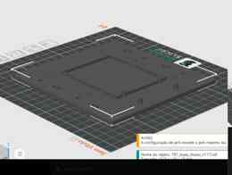
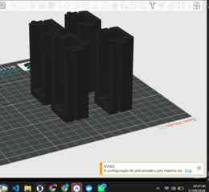
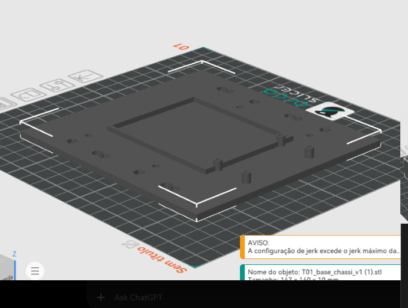
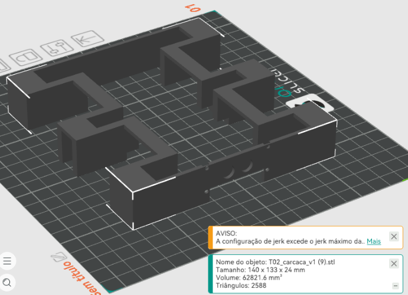
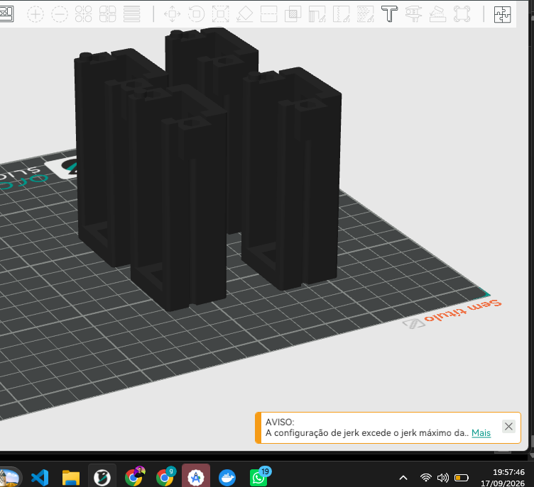
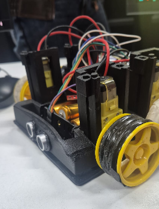
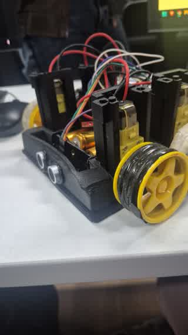

# Carrinho-robô com ESP32 — CUBI-04

> **Project-based Maker Lab — FIAP**  
> **Grupo: Start-up One**

## Integrantes

| Nome | RM |
|---|---|
| Enricco Rossi de Souza Carvalho Miranda | RM551717 |
| Gabriel Marquez Trevisan | RM99227 |
| Guilherme Silva dos Santos | RM551168 |
| Danilo Urze Aldred | RM99465 |
| Laura Claro Mathias | RM98747 |

---

## Resultado final


O **CUBI-04** é um carrinho-robô funcional desenvolvido para integrar **projeto mecânico, fabricação digital, eletrônica, programação, sensores e comunicação sem fio**. O protótipo utiliza chassi, carenagem e suportes desenvolvidos para impressão 3D, quatro motores TT, ESP32, ponte H L298N e sensores.

### Vídeo de demonstração

- [▶ Assistir ao vídeo final do carrinho](WhatsApp%20Video%202026-09-17%20at%207.53.06%20PM.mp4)
- [▶ Vídeo de evidência em `docs/videos`](docs/videos/MicrosoftTeams-video.mp4)

---

## Funcionalidades implementadas

- 4 motores TT, dois por lado;
- movimentação para frente e para trás;
- curvas para esquerda e direita;
- parada;
- controle remoto pelo celular via Wi-Fi;
- ESP32 operando como Access Point e servidor web;
- controle de velocidade dos motores;
- sensor ultrassônico HC-SR04 para estacionamento de ré;
- bipes progressivos conforme o obstáculo se aproxima;
- bloqueio/interrupção da ré a aproximadamente 5 cm;
- LDR para leitura de luminosidade;
- interface web com modos AUTO, CLARO e ESCURO;
- chassi, carenagem, suportes e travas fabricados em impressão 3D.

---

## Arquitetura do projeto

O celular conecta diretamente à rede criada pelo ESP32. Pela interface web, o usuário envia comandos de movimento. O ESP32 controla a ponte H L298N, que aciona os quatro motores. O HC-SR04 mede a distância durante a ré e o LDR fornece a leitura de luminosidade.


Documentação elétrica completa: [`hardware/arquitetura/README.md`](hardware/arquitetura/README.md).

---

## Projeto mecânico e fabricação 3D

O desenvolvimento mecânico foi **iterativo**. As peças foram modeladas, impressas, testadas fisicamente e corrigidas de acordo com os problemas encontrados na montagem.

### T01 — chassi/base final



Base estrutural otimizada para aproximadamente **147 × 140 × 10 mm**, com pontos de fixação e espaço para os componentes.

### T02 — carenagem final


A carenagem foi redesenhada para reduzir material e manter acesso aos componentes. As aberturas laterais são funcionais e permitem a passagem/encaixe dos conjuntos dos motores.

### Suportes dos motores



Os suportes passaram por várias versões até o conjunto final T03A/T03B v7.

| Peça | Função |
|---|---|
| T01 | Base/chassi estrutural |
| T02 | Carenagem com aberturas funcionais |
| T03A | Suporte do motor v7 |
| T03B | Presilha de retenção v7 |
| T04 | Tampa opcional de 2 mm |
| T05 | Trava vertical suporte ↔ chassi |
| T06 | Pino/parafuso impresso; dois por motor |

Arquivos STL/STEP, fontes e versões: [`cad/`](cad/).  
Pacote final: [`cad/PACOTE_FINAL_VERIFICADO.md`](cad/PACOTE_FINAL_VERIFICADO.md).

---

## Evolução e problemas encontrados

O repositório preserva versões anteriores para demonstrar o **processo de engenharia**, não apenas o resultado final.

Durante os testes foram encontrados problemas reais de fabricação e montagem, entre eles:

- folga lateral nos primeiros suportes de motor;
- laterais frágeis em versões anteriores;
- desalinhamento entre motor, eixo, roda e chassi;
- necessidade de adequação à largura real de aproximadamente 22 mm do motor TT;
- necessidade de reforçar frente e laterais dos suportes;
- ajustes nos furos, parafusos, porcas e travas inferiores;
- colisões e cortes CAD fora do material útil;
- corpos desconectados em versões intermediárias;
- ajustes no encaixe do HC-SR04;
- excesso de suporte detectado durante o fatiamento;
- revisão das aberturas laterais da carenagem para permitir a montagem dos motores.

As correções incluíram centralização do eixo, redução das folgas, reforço estrutural, reposicionamento dos suportes e revisão da carenagem. O histórico detalhado está em [`historico/HISTORICO_PROJETO_CUBI04.md`](historico/HISTORICO_PROJETO_CUBI04.md).

### Registro visual do processo

| Etapa 1 | Etapa 2 |
|---|---|
|  |  |
| **Etapa 3** | **Etapa 4** |
|  |  |

Essas imagens foram retiradas da raiz do repositório e centralizadas em `docs/evidencias/processo/`, mantendo a raiz limpa e as evidências fáceis de localizar.

---

## Hardware

| Componente | Especificação / uso |
|---|---|
| ESP32 | DevKit V1 / NodeMCU-ESP32 |
| Ponte H | L298N, dois canais |
| Motores | 4 × TT amarelos, 3–6 V, redução 48:1 |
| Alimentação | suporte com 3 × 18650 em série |
| Ultrassônico | HC-SR04 |
| Luminosidade | LDR |
| Estrutura | peças próprias impressas em 3D |

Lista detalhada: [`hardware/componentes/README.md`](hardware/componentes/README.md).

### ESP32 ↔ L298N

| L298N | ESP32 | Função |
|---|---:|---|
| ENA | GPIO 25 | controle canal A |
| IN1 | GPIO 26 | direção A |
| IN2 | GPIO 27 | direção A |
| ENB | GPIO 33 | controle canal B |
| IN3 | GPIO 32 | direção B |
| IN4 | GPIO 23 | direção B |
| GND | GND | referência comum |

### HC-SR04

| HC-SR04 | ESP32 |
|---|---:|
| VCC | 5 V |
| GND | GND comum |
| TRIG | GPIO 18 |
| ECHO | GPIO 19 via divisor resistivo |

> **Atenção:** o ECHO do HC-SR04 trabalha em nível de 5 V e deve chegar ao ESP32 através do divisor resistivo previsto no projeto.

### Alimentação

O suporte utiliza três células 18650 em série, resultando em aproximadamente **11,1 V nominais e até 12,6 V com as células totalmente carregadas**. O pack alimenta a entrada de potência da L298N. Durante testes, o ESP32 pode ser alimentado separadamente por USB/power bank, sempre mantendo **GND comum**.

Os motores TT são especificados para 3–6 V; portanto, a diferença entre a tensão do pack e a tensão adequada aos motores é uma limitação conhecida do protótipo e deve ser considerada na alimentação/controle.

---

## Software e controle remoto

Firmware principal: [`src/codigo.ino`](src/codigo.ino).  
Versão funcional preservada: [`src/v0.3/carrinho_robo_v0_3.ino`](src/v0.3/carrinho_robo_v0_3.ino).  
Documentação: [`src/README.md`](src/README.md).

O firmware integra Wi-Fi Access Point, servidor HTTP, comandos direcionais, acionamento dos motores, HC-SR04, bloqueio de ré, alertas sonoros no navegador, LDR, interface responsiva para celular e logs de diagnóstico.

### Como executar

1. Confira toda a fiação com o circuito desligado.
2. Alimente o ESP32 por USB/power bank durante os primeiros testes.
3. Abra [`src/codigo.ino`](src/codigo.ino) na Arduino IDE.
4. Selecione a placa compatível com o ESP32 utilizado.
5. Faça o upload do firmware.
6. Abra o Serial Monitor em `115200 baud`.
7. Conecte o celular à rede Wi-Fi criada pelo ESP32.
8. Abra no navegador o endereço exibido/configurado pelo firmware.
9. Teste primeiro parada e movimentos em condição segura, com as rodas livres.
10. Teste o HC-SR04 durante a ré aproximando um obstáculo gradualmente.
11. Varie a iluminação sobre o LDR e confira a leitura/interface.

---

## Experimentos em fase de teste

- [Aula 19 — práticas iniciais com TinyML](experimentos/tinyml-aula19/README.md): leitura bruta do HC-SR04, pré-processamento, classes perto/longe e roteiro para coletar o CSV. **Medições físicas e dataset real pendentes.** Códigos isolados do firmware principal.

---

## Planejamento e documentação

A organização do projeto também registra requisitos, prioridades e evolução:

- [`organizacao/BACKLOG.md`](organizacao/BACKLOG.md) — backlog;
- [`organizacao/MVP.md`](organizacao/MVP.md) — definição do MVP;
- [`organizacao/MOSCOW.md`](organizacao/MOSCOW.md) — priorização MoSCoW;
- [`organizacao/KANBAN.md`](organizacao/KANBAN.md) — acompanhamento das atividades;
- [`organizacao/DEPENDENCIAS.md`](organizacao/DEPENDENCIAS.md) — dependências;
- [`CHECKPOINT_01_VALIDACAO.md`](CHECKPOINT_01_VALIDACAO.md) — validação da entrega;
- [`docs/EVIDENCIAS_CHECKPOINT.md`](docs/EVIDENCIAS_CHECKPOINT.md) — central de evidências.

---

## Evidências finais

### Carrinho montado



### Evidências de fabricação

| Chassi T01 | Carenagem T02 | Suportes |
|---|---|---|
|  |  |  |

### Vídeos

- [Vídeo final — 17/09/2026](WhatsApp%20Video%202026-09-17%20at%207.53.06%20PM.mp4)
- [Vídeo de demonstração — Microsoft Teams](docs/videos/MicrosoftTeams-video.mp4)

---

## Organização do repositório

```text
Carrinho-Robo/
├── README.md
├── CHECKPOINT_01_VALIDACAO.md
├── cad/                    # CAD, STL, STEP, fontes e versões
├── docs/
│   ├── evidencias/         # fotos, CAD final e processo de montagem
│   │   └── processo/
│   └── videos/             # registros em vídeo
├── hardware/
│   ├── arquitetura/        # diagrama e ligações
│   └── componentes/        # componentes utilizados
├── experimentos/           # atividades e protótipos em fase de teste
│   └── tinyml-aula19/       # engenharia do dado com HC-SR04
├── historico/              # problemas, decisões e evolução
├── organizacao/            # backlog, MVP, MoSCoW, Kanban etc.
└── src/                    # firmware do ESP32
```

---

## Relação com o Check Point 01

| Critério | Evidência no repositório |
|---|---|
| Projeto mecânico | chassi próprio, CAD, STL/STEP, versões e renders |
| Fabricação digital | peças impressas, imagens do fatiador e registros de montagem |
| Movimentação | quatro motores TT + L298N + comandos direcionais |
| Controle sem fio | ESP32 + Wi-Fi + interface web pelo celular |
| Sensor integrado | HC-SR04 com alerta/bloqueio de ré e LDR |
| Eletrônica | componentes, pinagem, alimentação e diagrama |
| Programação | firmware completo em `src/` |
| Planejamento | backlog, MVP, MoSCoW, Kanban e dependências |
| Evolução | versões anteriores e histórico dos problemas/correções |
| Evidência final | fotos do protótipo e vídeos de demonstração |
| Documentação | README principal + validação + central de evidências |

Para uma conferência objetiva da entrega, consulte também [`CHECKPOINT_01_VALIDACAO.md`](CHECKPOINT_01_VALIDACAO.md).
