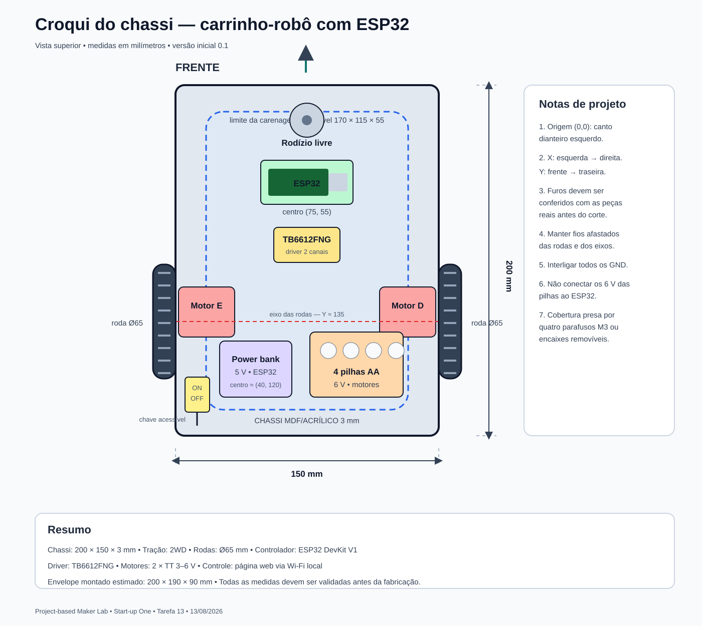

# Carrinho-robô com ESP32

Documentação inicial da **Tarefa 13 — Requisitos do projeto**, desenvolvida para a disciplina **Project-based Maker Lab**.

## Identificação do projeto

| Campo        | Informação          |
|--------------|---------------------|
| Instituição  | FIAP                |
|   Turma      | 4ESPX               |
| Professora   | Gedeane Kenshima    |
|   Grupo      | Start-up One        |
|   Data       | 13/08/2026          |
| Repositório  |[Link do repositório](https://github.com/seu-usuario/carrinho-robo-esp32)|

## Integrantes


| Nome completo                           |    RM    |
|-----------------------------------------|----------|
| Enricco Rossi de Souza Carvalho Miranda | RM551717 |
| Gabriel Marquez Trevisan                | RM99227  |
| Guilherme Silva dos Santos              | RM551168 |
| Danilo Urze Aldred                      | RM99465  |
| Laura Claro Mathias                     | RM98747  |


## 1. Objetivo do projeto

Construir um carrinho-robô pequeno, de baixo custo e fácil montagem, controlado por um celular. O ESP32 criará uma rede Wi-Fi local e uma página simples com os comandos **avançar**, **recuar**, **virar à esquerda**, **virar à direita** e **parar**. Assim, o protótipo não dependerá de internet nem de um aplicativo específico.

## 2. Conceito escolhido

O carrinho utilizará tração diferencial **2WD**: dois motores independentes movimentam as rodas laterais e um rodízio livre apoia a parte dianteira. Para virar, o ESP32 altera o sentido ou a velocidade de cada motor por meio do driver TB6612FNG.

### Por que essa solução?

- O ESP32 já possui Wi-Fi, evitando um módulo de comunicação adicional.
- Dois motores são suficientes para movimentar e direcionar o carrinho.
- O TB6612FNG aceita sinais de 3,3 V do ESP32 e tem menor perda de energia que o L298N.
- O chassi retangular pode ser cortado em MDF ou acrílico de 3 mm.
- A alimentação separada reduz ruídos dos motores e facilita os primeiros testes.

## 3. Ficha de requisitos

### 3.1 Requisitos físicos e mecânicos

| Item | Requisito definido |
|---|---|
| Dimensões do chassi | 200 mm × 150 mm × 3 mm (comprimento × largura × espessura) |
| Dimensão máxima montada | Aproximadamente 200 mm × 190 mm × 90 mm, incluindo rodas e carenagem |
| Material do chassi | MDF de 3 mm; acrílico de 3 mm é uma alternativa |
| Quantidade de motores | 2 motores DC com caixa de redução, modelo TT, 3–6 V |
| Rodas | 2 rodas de 65 mm para os motores e 1 rodízio livre dianteiro |
| Placa controladora | ESP32 DevKit V1, módulo ESP32-WROOM-32 |
| Driver dos motores | TB6612FNG de dois canais |
| Fixação | Parafusos M3, espaçadores e abraçadeiras; componentes sem contato direto com o MDF |
| Massa-alvo | Até 1,2 kg com as baterias |
| Carenagem | Cobertura removível de aproximadamente 170 mm × 115 mm × 55 mm |
| Material da carenagem | Placa de polipropileno de 1 mm, acetato grosso ou impressão 3D leve |
| Acesso externo | Conector USB do ESP32 e chave da alimentação dos motores devem ficar acessíveis |
| Ventilação | Aberturas laterais próximas ao ESP32 e ao driver |

### 3.2 Requisitos elétricos e de controle

| Item | Requisito definido |
|---|---|
| Alimentação dos motores | 4 pilhas AA em suporte, total nominal de 6 V |
| Alimentação do ESP32 | Power bank USB de 5 V |
| Referência elétrica | Os terras do power bank, ESP32, TB6612FNG e suporte de pilhas devem estar interligados |
| Comunicação | Rede Wi-Fi local criada pelo ESP32, sem necessidade de internet |
| Interface | Página web acessada pelo celular, com cinco comandos de movimento |
| Controle de velocidade | PWM independente para cada motor |
| Segurança de software | Parada automática se nenhum comando for recebido por 1 segundo |
| Segurança elétrica | Não ligar os 6 V das pilhas ao pino 5 V ou 3V3 do ESP32 |

> Para a montagem final, usar pilhas do mesmo tipo e estado de carga. Não misturar pilhas novas e usadas. Se forem utilizadas pilhas recarregáveis, empregar carregador apropriado.

## 4. Lista inicial de materiais

| Quantidade | Componente | Observação |
|---:|---|---|
| 1 | ESP32 DevKit V1 (ESP32-WROOM-32) | Controlador principal |
| 1 | Módulo TB6612FNG | Driver para os dois motores |
| 2 | Motor TT DC 3–6 V | Preferencialmente com a mesma redução |
| 2 | Roda de 65 mm | Compatível com o eixo do motor TT |
| 1 | Rodízio livre pequeno | Apoio dianteiro |
| 1 | Chapa de MDF 200 × 150 × 3 mm | Base do chassi |
| 1 | Suporte para 4 pilhas AA com chave | Alimentação dos motores |
| 4 | Pilha AA | Não misturar tipos ou cargas |
| 1 | Power bank USB 5 V | Alimentação do ESP32 |
| 1 | Cabo USB curto | Compatível com a placa escolhida |
| 1 | Chave liga/desliga | Caso o suporte de pilhas não tenha chave |
| — | Jumpers, fios e conectores | Para as ligações elétricas |
| — | Parafusos M3, porcas e espaçadores | Fixação dos módulos |
| — | Material leve para carenagem | PP, acetato ou peça impressa |

## 5. Posição dos componentes

Adota-se como origem o canto dianteiro esquerdo do chassi. A coordenada **X** é medida da esquerda para a direita e **Y** da frente para trás. As posições são iniciais e podem variar alguns milímetros durante a montagem.

| Componente | Centro aproximado (X, Y) | Justificativa |
|---|---:|---|
| Rodízio livre | (75 mm, 20 mm) | Apoio central na dianteira |
| ESP32 | (75 mm, 55 mm) | Protegido, acessível e afastado dos motores |
| TB6612FNG | (75 mm, 85 mm) | Próximo do ESP32 e com fios curtos até os motores |
| Motor esquerdo | (18 mm, 135 mm) | Alinhado ao motor direito |
| Motor direito | (132 mm, 135 mm) | Alinhado ao motor esquerdo |
| Suporte de 4 pilhas AA | (100 mm, 120 mm) | Massa baixa e próxima ao eixo das rodas |
| Power bank | (40 mm, 120 mm) | Equilibra lateralmente o suporte de pilhas |
| Chave dos motores | (15 mm, 175 mm) | Acesso externo sem retirar a carenagem |

## 6. Sugestão de pinos do ESP32

| Função no TB6612FNG | Pino do ESP32 | Função |
|---|---:|---|
| PWMA | GPIO 25 | Velocidade do motor esquerdo |
| AIN1 | GPIO 26 | Sentido do motor esquerdo |
| AIN2 | GPIO 27 | Sentido do motor esquerdo |
| PWMB | GPIO 33 | Velocidade do motor direito |
| BIN1 | GPIO 32 | Sentido do motor direito |
| BIN2 | GPIO 14 | Sentido do motor direito |
| STBY | GPIO 13 | Habilita ou desabilita o driver |
| VCC | 3V3 | Alimentação lógica do driver |
| GND | GND | Terra comum |
| VM | 6 V das pilhas | Alimentação exclusiva dos motores |

Os terminais A01/A02 devem ser ligados ao motor esquerdo e B01/B02 ao motor direito. Se uma roda girar no sentido oposto ao esperado, basta inverter os dois fios desse motor ou corrigir o sentido no programa.

## 7. Requisitos funcionais

| Código | Requisito | Critério de aceitação |
|---|---|---|
| RF-01 | Criar uma rede Wi-Fi própria | A rede aparece no celular até 30 s após ligar o ESP32 |
| RF-02 | Exibir a interface de controle | A página abre no endereço local informado no projeto |
| RF-03 | Executar cinco comandos | O carrinho avança, recua, gira para os dois lados e para |
| RF-04 | Controlar os motores separadamente | Cada motor responde ao canal correspondente do driver |
| RF-05 | Parar em caso de perda de comando | Os dois motores param após 1 s sem atualização |
| RF-06 | Permitir manutenção | A carenagem pode ser retirada sem remover rodas ou motores |

## 8. Requisitos não funcionais

| Código | Requisito |
|---|---|
| RNF-01 | A estrutura deve suportar pequenos impactos de testes em piso plano. |
| RNF-02 | Fios e módulos não podem tocar nas rodas nem ficar soltos. |
| RNF-03 | O centro de massa deve permanecer baixo e entre o rodízio e o eixo das rodas. |
| RNF-04 | A montagem deve usar componentes modulares e facilmente substituíveis. |
| RNF-05 | A carenagem não pode bloquear a antena, o USB, a ventilação ou as rodas. |
| RNF-06 | O protótipo deve funcionar em superfície interna, seca e relativamente lisa. |

## 9. Croqui do chassi

O croqui digital apresenta a vista superior, as dimensões principais, o eixo das rodas e a posição inicial dos componentes.



Arquivo em tamanho completo: [`docs/croqui-chassi.svg`](docs/croqui-chassi.svg).

## 10. Sequência sugerida de montagem

1. Cortar e furar o chassi conforme o croqui.
2. Fixar os motores e conferir o alinhamento das rodas.
3. Fixar o rodízio dianteiro e verificar se o chassi fica nivelado.
4. Instalar ESP32 e TB6612FNG sobre espaçadores.
5. Prender o suporte de pilhas e o power bank com abraçadeiras ou fita de fixação removível.
6. Fazer as ligações com todas as fontes desligadas e conferir o terra comum.
7. Testar um motor por vez com as rodas suspensas.
8. Testar os comandos em baixa velocidade e só depois instalar a carenagem.

## 11. Plano de testes inicial

| Teste | Procedimento | Resultado esperado |
|---|---|---|
| Inspeção | Conferir fios, polaridade e fixações com o carrinho desligado | Nenhum curto, fio solto ou contato com rodas |
| Motor esquerdo | Acionar apenas o canal A com as rodas suspensas | Somente a roda esquerda gira |
| Motor direito | Acionar apenas o canal B com as rodas suspensas | Somente a roda direita gira |
| Movimento | Executar os cinco comandos no piso | Resposta correta a cada comando |
| Comunicação | Afastar o celular gradualmente em ambiente interno | Controle estável na área prevista para demonstração |
| Fail-safe | Interromper o envio de comandos durante o movimento | Parada automática em até 1 s |
| Carenagem | Instalar a cobertura e repetir um trajeto curto | Sem aquecimento excessivo ou contato com partes móveis |

## 12. Próximas etapas

- Validar as medidas com os componentes físicos disponíveis no laboratório.
- Fazer a lista definitiva de materiais e custos.
- Produzir o chassi e a carenagem.
- Desenvolver o firmware e a página de controle.
- Registrar fotos, testes, dificuldades e melhorias neste repositório.

## 13. Publicação no GitHub

1. Criar um repositório chamado `carrinho-robo-esp32`.
2. Adicionar este arquivo `README.md` na raiz do repositório.
3. Criar a pasta `docs` e adicionar `croqui-chassi.svg` dentro dela.
4. Preencher os nomes dos integrantes e os demais campos da seção **Identificação**.
5. Fazer o primeiro commit com a mensagem `docs: adiciona requisitos e croqui inicial`.
6. Copiar o endereço do repositório, colá-lo na tabela de identificação e enviar esse link na atividade.

Estrutura esperada:

```text
carrinho-robo-esp32/
├── README.md
└── docs/
    └── croqui-chassi.svg
```

## 14. Histórico

| Data | Versão | Alteração |
|---|---|---|
| 13/08/2026 | 0.1 | Ficha de requisitos e croqui inicial |
