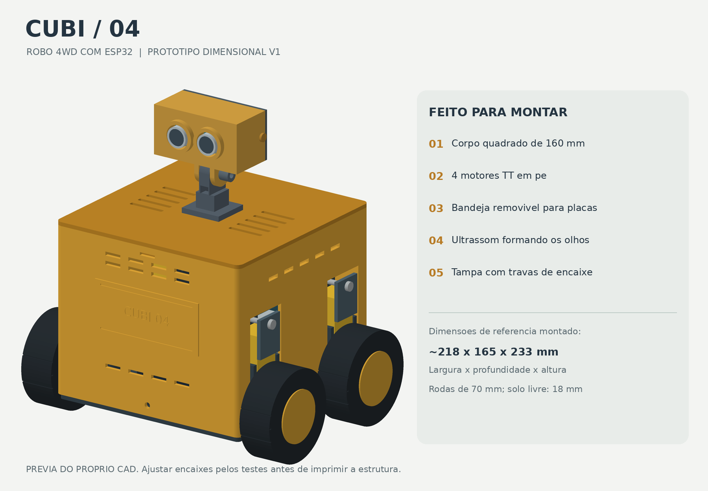
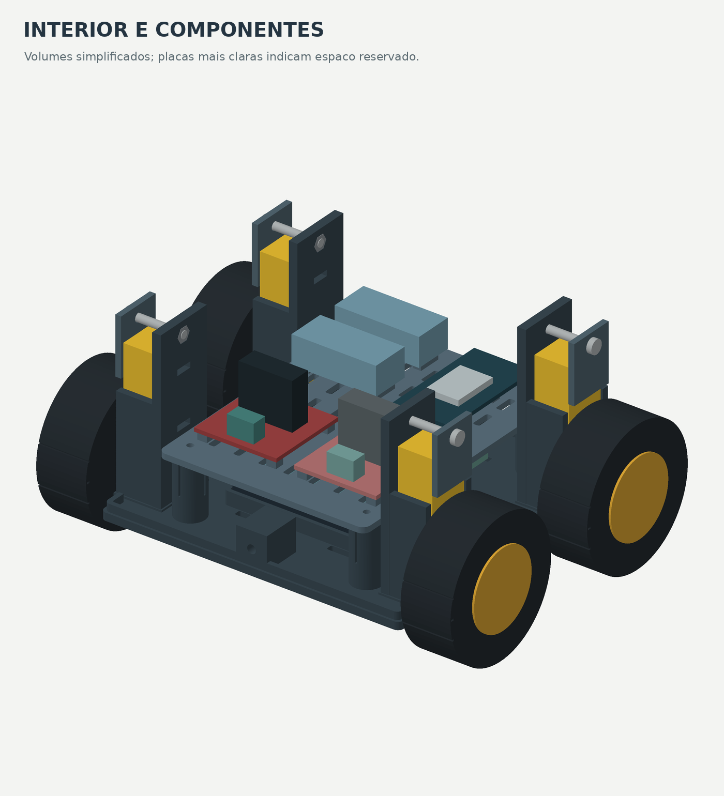
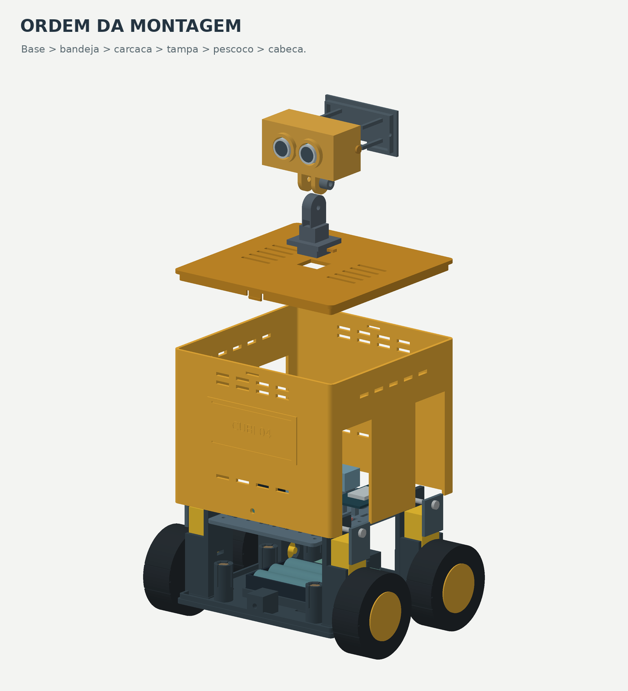
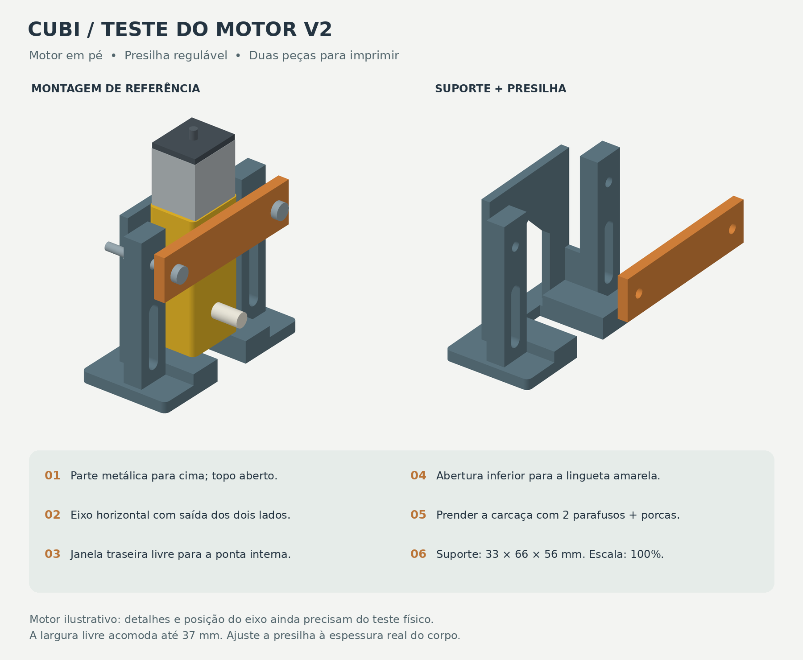
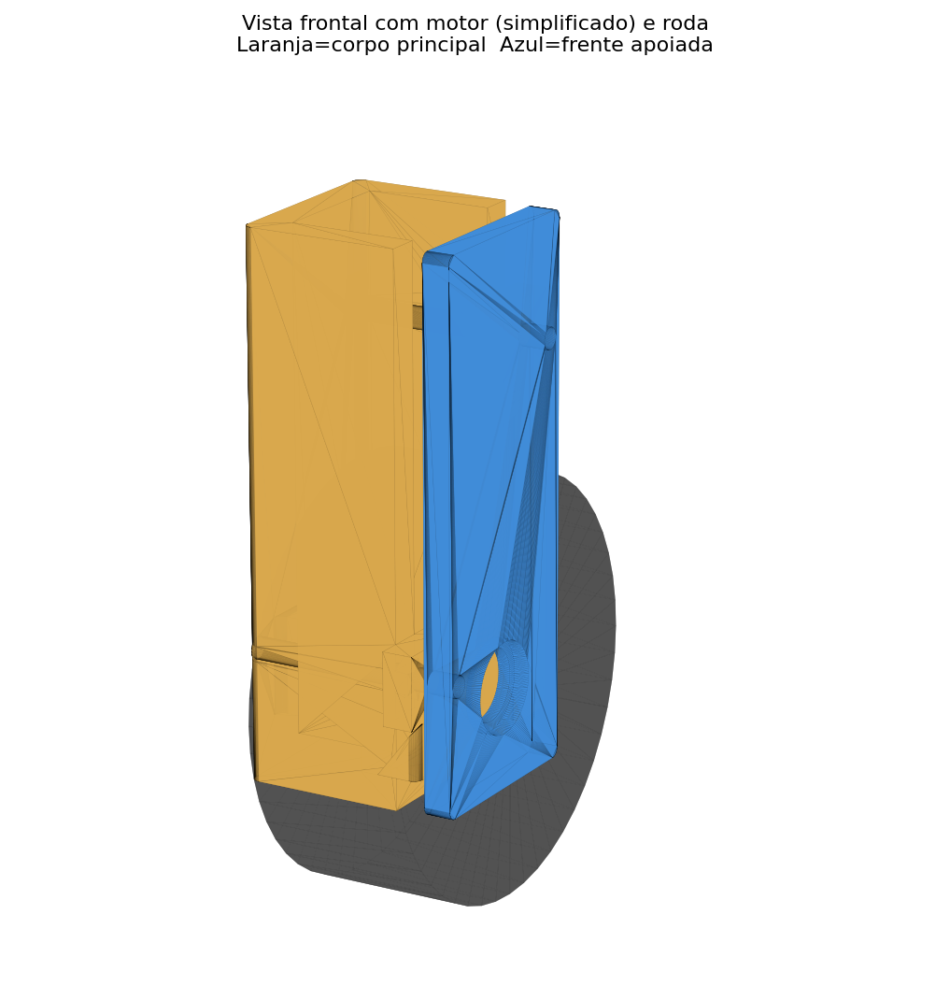

# Evidências — Check Point 01

Este documento organiza as evidências já existentes no repositório e relaciona cada uma ao desenvolvimento do carrinho-robô.

## Equipe

| Integrante | RM |
|---|---|
| Enricco Rossi de Souza Carvalho Miranda | RM551717 |
| Gabriel Marquez Trevisan | RM99227 |
| Guilherme Silva dos Santos | RM551168 |
| Danilo Urze Aldred | RM99465 |
| Laura Claro Mathias | RM98747 |

## 1. Processo de projeto mecânico

O projeto possui registros de múltiplas versões. A permanência dessas versões no GitHub é intencional e demonstra o processo de desenvolvimento, erros encontrados e alterações realizadas.

### Arquitetura inicial

Essa etapa representa uma proposta anterior e não deve ser interpretada como a configuração mecânica final. O conceito evoluiu posteriormente para quatro motores TT, L298N, chassi menor e carenagem baixa.

## 2. Evolução dos suportes dos motores

### Versão v2

### Versão v3

O suporte passou por sucessivas revisões até o conceito T03A/T03B v7. Entre os motivos estavam folga lateral, fragilidade frontal, encaixe do motor, posição do eixo e necessidade de alinhar as rodas com o chassi.

## 3. Adaptação do chassi e alinhamento das rodas — 15/09/2026

Durante a montagem foi identificado que o posicionamento inicialmente adotado não garantia que o conjunto motor/eixo/roda permanecesse corretamente alinhado. O problema não era apenas estético: a roda precisava permanecer para fora da estrutura, sem interferir no chassi ou na carenagem.

Foram realizados:

- reposicionamento dos suportes no chassi;
- ajuste da largura interna à dimensão real do motor TT;
- centralização do eixo;
- redução de folgas laterais;
- reforço de regiões frágeis;
- revisão das fixações;
- manutenção das aberturas laterais da carenagem para passagem/encaixe dos suportes;
- uso de travas e pontos de fixação acessíveis para montagem e manutenção.

O histórico completo está em [`../historico/HISTORICO_PROJETO_CUBI04.md`](../historico/HISTORICO_PROJETO_CUBI04.md).

## 4. Chassi e carenagem atuais

A documentação atual identifica:

- T01 — base/chassi otimizado;
- T02 — carenagem baixa com aberturas funcionais;
- T03A — suporte do motor;
- T03B — presilha;
- T04 — tampa opcional;
- T05 — trava vertical;
- T06 — pino/parafuso impresso.

Os modelos e a evolução mecânica estão em [`../cad/`](../cad/).

## 5. Hardware e integração

A configuração documentada utiliza ESP32, L298N, quatro motores TT, pack de três 18650, HC-SR04 e LDR. O diagrama elétrico está disponível abaixo.

A pinagem e os cuidados de alimentação estão detalhados em [`../hardware/arquitetura/README.md`](../hardware/arquitetura/README.md).

## 6. Sensor integrado

O HC-SR04 é utilizado no firmware atual como sensor de estacionamento de ré. Conforme a distância diminui, o navegador produz alertas progressivamente mais rápidos. A 5 cm ou menos, o comando de ré é interrompido.

O LDR no GPIO 34 também possui função de software: fornece a leitura de luminosidade e, no modo AUTO, participa da seleção do tema da interface.

## 7. Controle remoto sem fio

O ESP32 cria a rede Wi-Fi `tony`. O celular conecta diretamente ao ESP32 e acessa o painel em `192.168.4.1`. O firmware contém comandos de frente, ré, esquerda, direita, parada e controle PWM.

## 8. Registro físico e vídeo existentes

### Registro físico

### Vídeo

[MicrosoftTeams-video.mp4](videos/MicrosoftTeams-video.mp4)

Esses arquivos são preservados como evidências já existentes. O conteúdo do vídeo não é descrito aqui além do que foi efetivamente verificado pelo repositório; na apresentação, a equipe deve demonstrar claramente as funções do protótipo que estiverem operacionais.

## 9. Software

O código atual está em [`../src/codigo.ino`](../src/codigo.ino), com versão v0.3 preservada em [`../src/v0.3/`](../src/v0.3/). A documentação de funcionamento está em [`../src/README.md`](../src/README.md).

## 10. Planejamento e evolução

Os documentos de requisitos e planejamento estão em [`../organizacao/`](../organizacao/), incluindo backlog, MVP, MoSCoW, Kanban, dependências e custos. O histórico registra dificuldades e correções para mostrar o processo, e não somente o resultado final.

## 11. Uso básico

1. conferir a fiação com o circuito desligado;
2. alimentar o ESP32 por USB/power bank;
3. carregar `src/codigo.ino` no ESP32;
4. conectar o celular à rede `tony`;
5. acessar `192.168.4.1`;
6. ativar o áudio do painel;
7. iniciar com PWM baixo;
8. testar os comandos direcionais;
9. testar o HC-SR04 durante a ré;
10. testar o LDR variando a iluminação.

## 12. Observação sobre evidências finais

Renders, arquivos CAD e registros de desenvolvimento comprovam o processo de projeto. Uma fotografia real da montagem final e uma demonstração física completa devem representar o protótipo efetivamente apresentado; não devem ser substituídas por imagem gerada ou por uma versão CAD diferente da montagem real.
