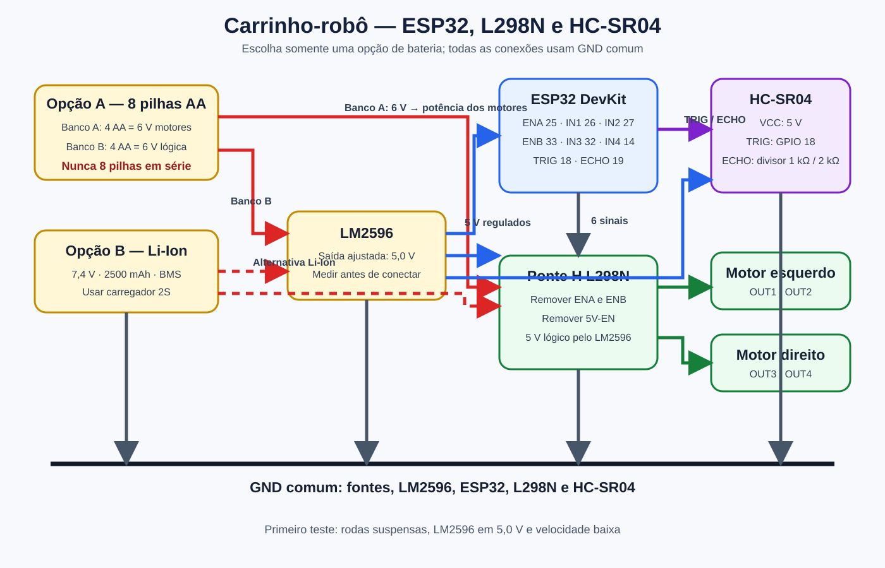

# Arquitetura eletrônica

O protótipo utiliza ESP32 DevKit V1, ponte H L298N, dois motores TT e sensor ultrassônico HC-SR04. O ESP32 cria a rede Wi-Fi e hospeda a página de controle local.



## Opções de alimentação

### Opção A — 8 pilhas AA Duracell

As oito pilhas são divididas em **dois suportes independentes de quatro pilhas**:

- banco A, 6 V: alimenta a entrada `12V/Vs` da L298N e os motores;
- banco B, 6 V: entra no LM2596, ajustado para 5,0 V, que alimenta ESP32, HC-SR04 e lógica da L298N;
- todos os GNDs devem permanecer interligados.

> Não ligar as oito pilhas em série. Um suporte de oito pilhas em série entregaria aproximadamente 12 V e pode danificar os motores de 3–6 V.

### Opção B — Pack Li-Ion 7,4 V 2500 mAh com BMS

- a saída do pack alimenta a entrada `12V/Vs` da L298N;
- em paralelo, a saída do pack entra no LM2596;
- o LM2596 deve ser regulado e medido em **5,0 V antes** de conectar ESP32, HC-SR04 e lógica da L298N;
- usar carregador Li-Ion 2S compatível; o BMS não substitui o carregador.

## ESP32 → L298N

Remover os jumpers `ENA` e `ENB` para usar PWM. Ao alimentar a lógica da L298N pelo LM2596, remover também o jumper `5V-EN`.

| ESP32 | L298N | Função |
|---:|---|---|
| GPIO 25 | ENA | Velocidade do motor esquerdo |
| GPIO 26 | IN1 | Direção do motor esquerdo |
| GPIO 27 | IN2 | Direção do motor esquerdo |
| GPIO 33 | ENB | Velocidade do motor direito |
| GPIO 32 | IN3 | Direção do motor direito |
| GPIO 14 | IN4 | Direção do motor direito |
| GND | GND | Terra comum |

## Motores → L298N

| Componente | L298N |
|---|---|
| Motor esquerdo | OUT1 e OUT2 |
| Motor direito | OUT3 e OUT4 |

Se um motor girar invertido, trocar os dois fios desse motor ou ajustar a constante correspondente em `src/codigo.ino`.

## HC-SR04 → ESP32

| HC-SR04 | Ligação |
|---|---|
| VCC | 5 V regulados pelo LM2596 |
| GND | GND comum |
| TRIG | GPIO 18 |
| ECHO | GPIO 19 por divisor de tensão |

O `ECHO` do HC-SR04 trabalha em 5 V e não deve ser ligado diretamente ao ESP32. Usar:

```text
ECHO ── resistor 1 kΩ ──┬── GPIO 19
                         │
                    resistor 2 kΩ
                         │
                        GND
```

## Verificação antes de ligar

1. Fazer todas as conexões com as fontes desligadas.
2. Ajustar o LM2596 para 5,0 V usando multímetro.
3. Conferir polaridade e GND comum.
4. Verificar os jumpers `ENA`, `ENB` e `5V-EN`.
5. Fazer o primeiro teste com as rodas suspensas.
6. Começar com velocidade baixa e observar aquecimento da L298N.

