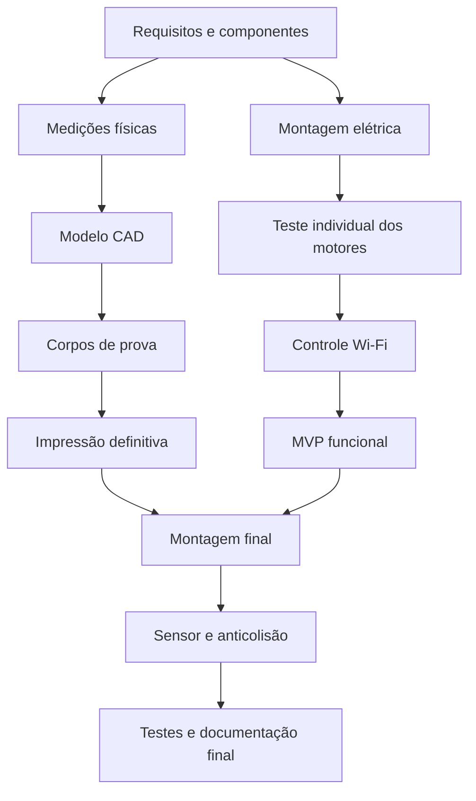

# Dependências do projeto

As tarefas foram organizadas para que o grupo saiba o que pode ser executado em paralelo e o que bloqueia a próxima etapa.

## Fluxo principal

## Tabela de dependências

| Etapa | Depende de | Motivo | Libera |
|---|---|---|---|
| Conferência dos componentes | Requisitos definidos | Confirma modelos, tensões e dimensões | Montagem elétrica e medições |
| Montagem da alimentação | Conferência dos componentes | Evita polaridade ou tensão incorreta | Ligação da L298N e do ESP32 |
| Ligação ESP32-L298N | Alimentação segura | O teste não deve ocorrer sem GND comum e fonte correta | Teste individual dos motores |
| Teste dos motores | Ligação ESP32-L298N | Confirma canais, sentido e capacidade da fonte | Controle Wi-Fi integrado |
| Controle Wi-Fi | Firmware gravado e motores testados | A interface precisa comandar um circuito funcional | MVP |
| Base provisória | Dimensões gerais dos componentes | Deve sustentar os itens sem bloquear as rodas | Montagem do MVP |
| MVP integrado | Controle Wi-Fi, motores e base provisória | Reúne todas as funções essenciais | Validação do MVP |
| Modelo CAD | Medições com paquímetro | O CAD depende das dimensões reais | Corpos de prova |
| Corpos de prova | Modelo CAD inicial | Validam furos, folgas, encaixes e eixos | Correção do CAD |
| Impressão definitiva | Correção após os encaixes | Evita desperdício de material | Montagem mecânica final |
| Sensor ultrassônico | Alimentação segura e suporte impresso | Exige 5 V, divisor no ECHO e posição frontal livre | Anticolisão |
| Testes finais | Montagem mecânica, elétrica e firmware | Só podem validar o conjunto completo | Produto concluído |

## Atividades que podem ocorrer em paralelo

- firmware Wi-Fi e conferência dos componentes;
- documentação de gestão e montagem elétrica;
- compra/separação de parafusos e medição das peças;
- desenvolvimento do suporte do sensor e testes do HC-SR04 em bancada;
- produção das evidências e execução dos testes.

## Caminho crítico

O caminho com maior risco de atrasar a conclusão é:

**medir componentes -> modelar em CAD -> imprimir corpos de prova -> corrigir CAD -> imprimir peças definitivas -> montar -> testar**.

Qualquer atraso de medição ou impressão afeta diretamente a montagem final. Por isso, o firmware e o circuito serão validados primeiro em bancada e em uma base provisória.

## Principais bloqueios e respostas

| Bloqueio | Impacto | Ação preventiva |
|---|---|---|
| Componente ainda não medido | CAD incorreto | Medir todas as peças antes da modelagem final |
| Impressora indisponível | Atraso do chassi | Reservar horário e manter base provisória para o MVP |
| Motor girando ao contrário | Movimento incorreto | Inverter os fios ou a constante correspondente no firmware |
| ESP32 reiniciando ao acelerar | MVP instável | Separar alimentação dos motores, manter GND comum e verificar a fonte |
| Esteira escapando | Carrinho não realiza curvas | Ajustar alinhamento, guias laterais e tensão |
| ECHO ligado diretamente | Risco ao GPIO do ESP32 | Usar divisor de 1 kΩ e 2 kΩ antes do GPIO 19 |

